# 游戏背景

命案出现后，预备魔女们前往现场，搜集证据。

在每个人都被怀疑的状况下，预备魔女们开始收集对自己有利的证据，并努力证明自己的清白。

# 游戏目标

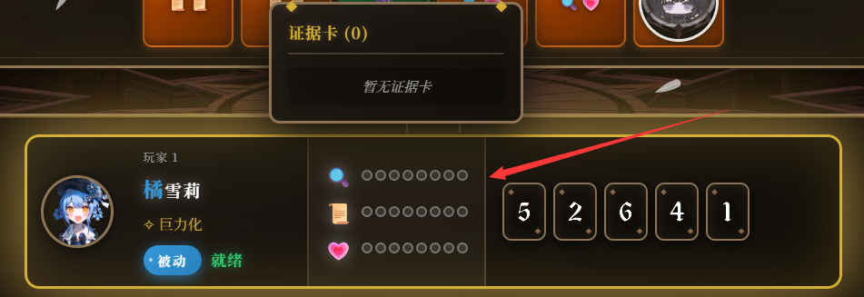

每回合移动并收集证据，将证据、证词、人心各达到8点，即可宣告胜利

# 移动
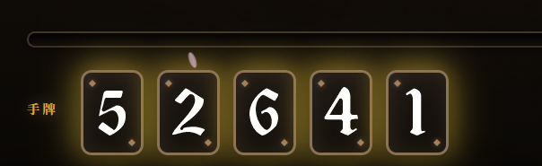
每一个回合，系统会随机出2-4小轮，并发给玩家小轮数量+1的手牌。每一个小轮玩家依次按照顺位进行如下操作：

1. 打出一张手牌，然后移动相应步数。
2. 移动到格子上触发格子效果，收集到证据或者删除自己的一个证据

当本回合结束后，进入下一回合，并重新随机所有格子的效果。

# 格子

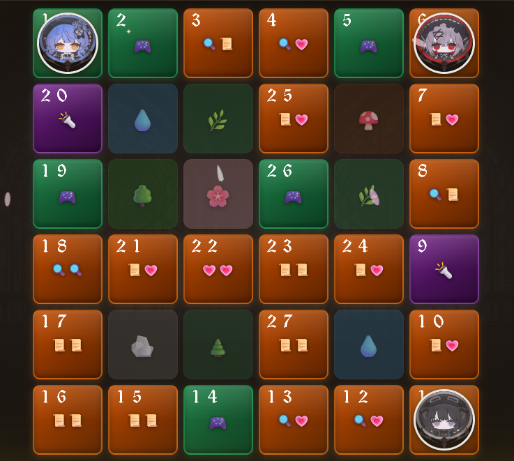
格子有以下三种：
1. 现场： 获得一个证据 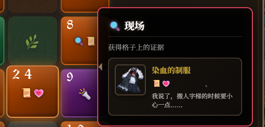
2. 地下室： 从三个随机证据中获得一个证据，或者不选 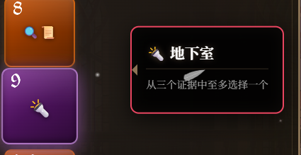
3. 娱乐室： 删除至多自己的一个证据 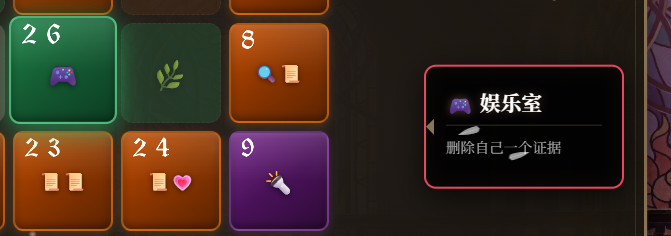

> ⚠️ 注意： 本回合被踩过的格子不可以再次被任何人触发

# 魔女化

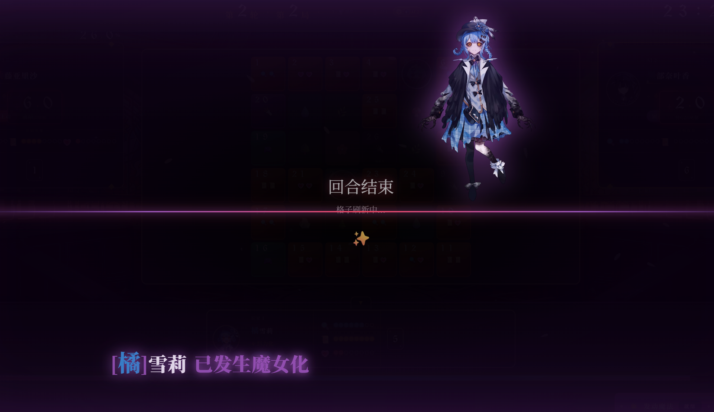
角色会因为证据的量、交锋失败和魔法带来的精神压力等方式增加魔女化。一旦角色魔女化进度条达到100%，将会触发魔女化。
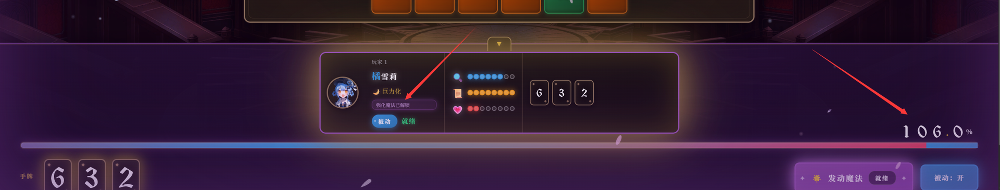
魔女化后，角色将在下一个回合结束后被处刑。期间角色仍然可以搜集证据，可以赶在被处刑前宣告胜利。
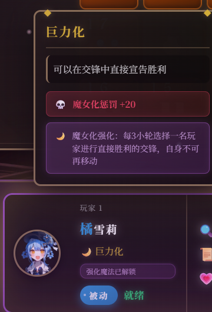
魔女化会大幅强化角色的魔法。

1. 施法会受到魔女化惩罚，依据角色而变
2. 交锋失败会受到5点魔女化惩罚
3. 每一回合结算时，将会给角色造成证物、证词、人心点数之和的魔女化惩罚
4. 每一个小轮结束后，超出8点上上限部分的证物、证词、人心将会额外对角色造成魔女化惩罚

# 魔法
每个角色都有自己的魔法。魔法可以在可以发动时发动，但是要注意，魔法发动会增加角色的压力，从而促进魔女化。

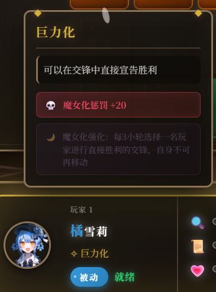

魔法发动
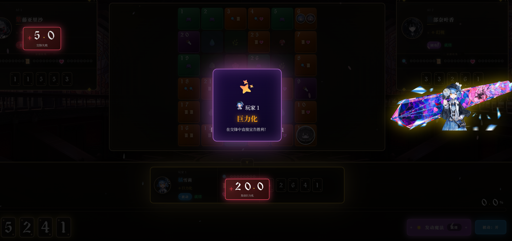

魔女化后的技能会得到强化。

# 交锋
当两名或以上玩家在移动的时候擦肩而过，将会触发交锋。
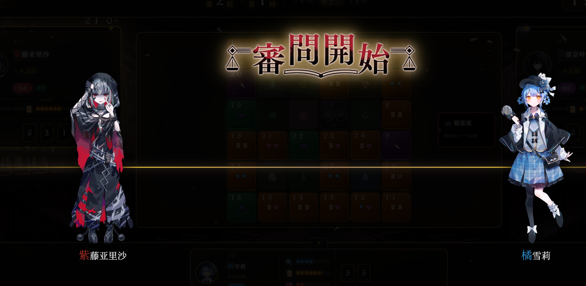
交锋时，所有玩家观察屏幕上的指示灯。当指示灯亮后，点击屏幕。反应最快的玩家将获得胜利。
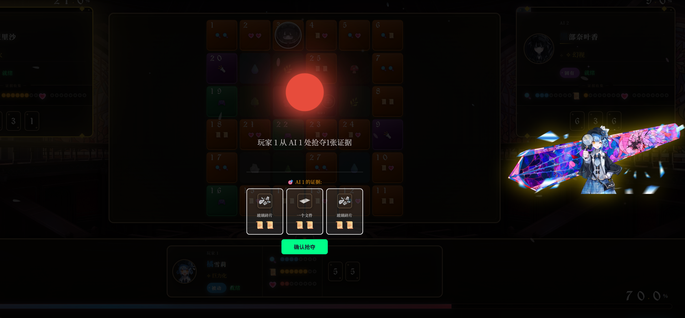

结算时，除了第一名之外的所有角色都会因为精神压力受到5点魔女化，然后从第一名开始，依次抢夺下一名的一个证物。

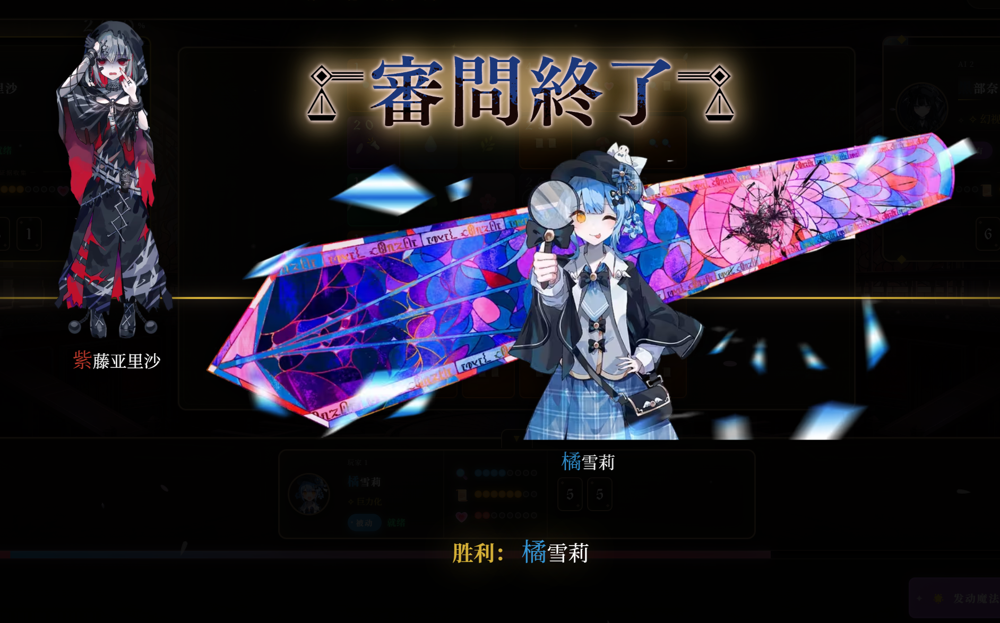
